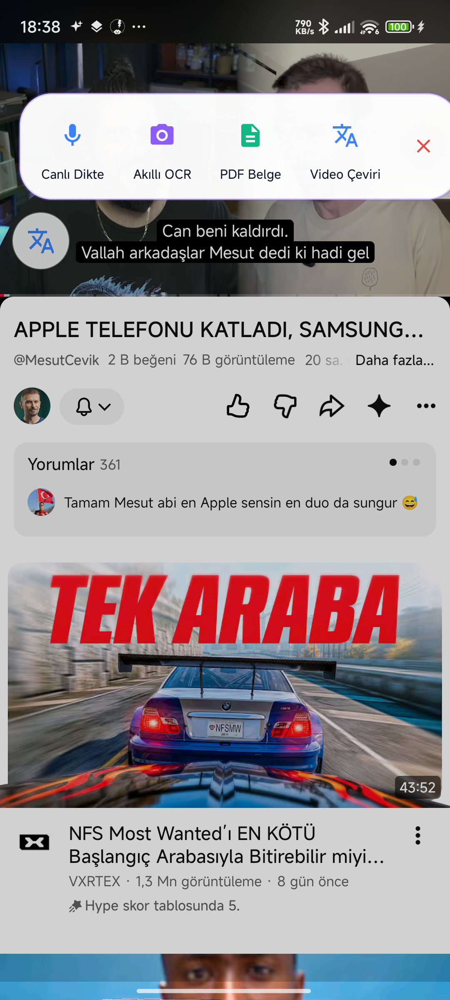
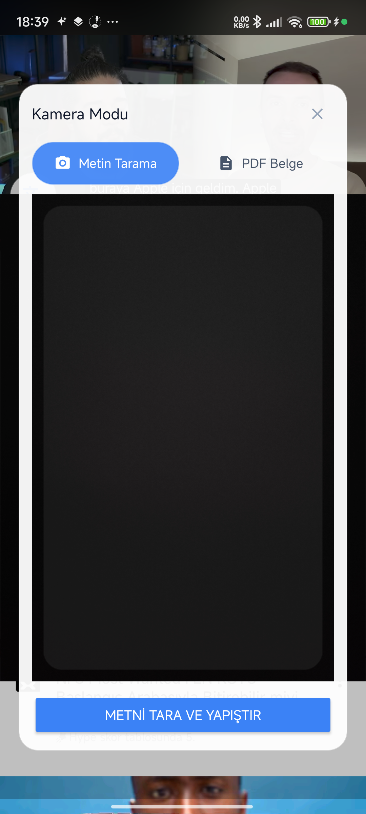
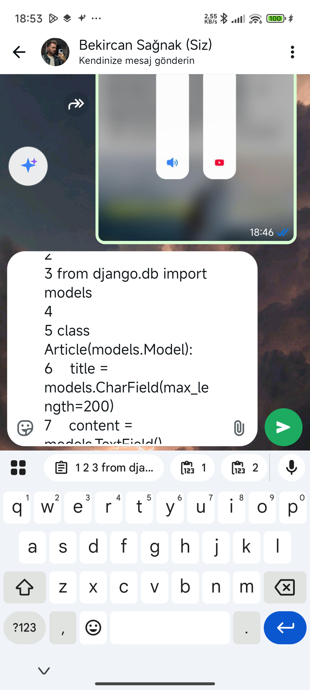

# 🌟 Gemini Floating Companion (Android)
### 🫧 Cam Bento Kayan Baloncuk • 🎙️ Canlı Ses Dikte • 📸 Gemini 3.8/2.5 Flash Akıllı OCR • 📄 CamScanner Renkli Belge & PDF

[](https://github.com/bekircansnk/gemini-floating-companion)
[-3DDC84?logo=android&logoColor=white)](https://developer.android.com)
[](https://kotlinlang.org)
[](LICENSE)
[](https://github.com/bekircansnk/gemini-floating-companion/releases)

---

**Gemini Floating Companion**, modern Android (özellikle Xiaomi HyperOS / MIUI) cihazlar için geliştirilmiş açık kaynaklı, ultra hafif (< 23MB) ve sıfır arka plan çöküşlü yeni nesil bir yapay zeka asistanıdır. Gboard ve diğer klavyelerinizden ödün vermeden; sadece yazı yazarken beliren, sesinizi gerçek zamanlı harfe döken ve kameranızla çektiğiniz belgeleri/tabloları anında aktif metin kutunuza yapıştıran kusursuz bir deneyim sunar.

---

## 📸 Ekran Görüntüleri & Canlı Akış

| 1. 🫧 Kayan Cam Radyal Menü | 2. 📸 Klavyeyle Uyumlu Canlı OCR | 3. ✅ Aktif Mesaja Anında Yapıştırma |
| :---: | :---: | :---: |
|  |  |  |
| *Baloncuğa uzun basıldığında açılan 4 yönlü hızlı eylem menüsü.* | *Gboard klavyesi açıkken dikey marjini koruyan cam vizör.* | *Çekim bittiği an panoya kopyalanıp WhatsApp'a doğrudan yazılan metin.* |

---

## ✨ Öne Çıkan Özellikler

### 1. 🫧 Akıllı Odak Tespiti & Cam Bento (Glassmorphism)
- **Klavye & Giriş Kutusu Algılama:** `AccessibilityService` motoru ile yalnızca kullanıcı bir metin kutusuna dokunduğunda (WhatsApp, Notlar, Arama vb.) ekranda yumuşakça belirir.
- **Otomatik Gizlenme:** Yazı alanından çıktığınızda baloncuk kendiliğinden kaybolur; ekranda asla fazlalık yaratmaz.
- **Manyetik Kenara Yapışma (Snap-to-Edge):** Ekranın sağına ve soluna pürüzsüz yay fiziğiyle tutunur.

### 2. 🎙️ Tek Dokunuş: Anlık Canlı Ses Dikte (Gemini Live API)
- Konuşmanın bitmesini beklemez; 16 kHz 16-bit PCM ses akışıyla kelimeleri canlı olarak aktif alana döker.
- Minimal formunu korur; baloncuk üzerinde metin kalabalığı yapmaz ve mükerrer yapıştırma korumalıdır.

### 3. 📸 Akıllı Görsel OCR & Markdown Tablo Algılama
- Fiziksel kağıt, ekran, kod veya tabloları çeker çekmez arayüz **beklemeden kapanır**; arka planda Gemini Vision analizi çalışır.
- Tabloları temiz Markdown ızgarasına (`| Başlık |`), yapılacak işleri görev listelerine (`- [ ]`) dönüştürür.
- Metin hem panoya alınır hem de mesaj kutusuna sessizce yapıştırılır.

### 4. 📄 CamScanner Tarzı Renkli Belge & PDF Paylaşımı
- Çekilen belgenin masa arka planını kırpar (otomatik köşe tespiti).
- Siyah-beyaz binarizasyon yerine resmi mühürleri, renkli imzaları ve fotoğrafları canlı tutan "Magic Color" filtresi uygular.
- Tek tıkla A4 PDF oluşturup WhatsApp/Telegram/Mail paylaşım sayfasını (`ACTION_SEND`) tetikler.

### 5. 🛡️ Kesintisiz API Failover Havuzu (Google AI Studio)
- Birden fazla API anahtarı arasında yük dengeler.
- `gemini-3.8-flash` yoğunluk durumunda (HTTP 503 Spike) veya kota aşımında (429) otomatik olarak `gemini-2.5-flash` ve `gemini-3.5-flash-lite` modellerine geçerek işlemi asla yarıda bırakmaz.

---

## 📥 Hemen İndirin (Hazır APK)

API anahtarı içermeyen, tamamen temiz ve herkese açık resmi APK sürümünü [Releases](https://github.com/bekircansnk/gemini-floating-companion/releases) sayfasından indirebilirsiniz:

👉 **[GeminiCompanion-v1.1.0-clean-opensource.apk İndir](https://github.com/bekircansnk/gemini-floating-companion/releases/download/v1.1.0/GeminiCompanion-v1.1.0-clean-opensource.apk)**

> **Kurulum Sonrası İlk Adım:** Uygulamayı açın ve Google AI Studio'dan aldığınız ücretsiz API anahtarınızı girin.

---

## 🚀 Kaynak Koddan Derleme (Geliştiriciler İçin)

### Ön Koşullar
- Android Studio Ladybug / Koala veya Android SDK (API 26..35)
- JDK 17 (OpenJDK 17 önerilir)

### 1. Depoyu Klonlayın
```bash
git clone https://github.com/bekircansnk/gemini-floating-companion.git
cd gemini-floating-companion
```

### 2. Yapılandırma (`local.properties`)
Proje kök dizinindeki `local.properties` dosyanıza SDK yolunu ekleyin (isteğe bağlı olarak test API anahtarlarınızı da ekleyebilirsiniz):
```properties
sdk.dir=/Users/kullanici/Library/Android/sdk
```

### 3. Derleme ve Cihaza Kurulum
```bash
export JAVA_HOME="/opt/homebrew/opt/openjdk@17"
./gradlew assembleDebug
adb install -r -g app/build/outputs/apk/debug/app-debug.apk
```

---

## 🔒 Gizlilik ve Güvenlik

- **Veri Saklama:** Ses ve görsel kayıtları telefonunuzda kalıcı olarak depolanmaz; geçici analiz sonrasında derhal silinir.
- **Sıfır İzleyici:** Uygulama içerisinde 3. taraf analiz veya reklam SDK'sı bulunmaz.
- **Doğrudan İletişim:** Tüm istekler aracısız şekilde resmi Google Gemini API uç noktalarına şifreli (TLS 1.3 / HTTPS) olarak gönderilir.

---

## 🤝 Katkıda Bulunma

Projeye katkıda bulunmak isterseniz:
1. Depoyu Fork'layın (`Fork`).
2. Yeni bir özellik dalı açın (`git checkout -b feat/harika-ozellik`).
3. Değişikliklerinizi commit edin (`git commit -m 'feat: harika ozellik eklendi'`).
4. Dalınıza push yapın (`git push origin feat/harika-ozellik`).
5. Bir Pull Request açın!

---

## 📜 Lisans

Bu proje [Apache 2.0 Lisansı](LICENSE) ile lisanslanmıştır. Açık kaynak standartlarında özgürce incelenebilir, geliştirilebilir ve dağıtılabilir.
